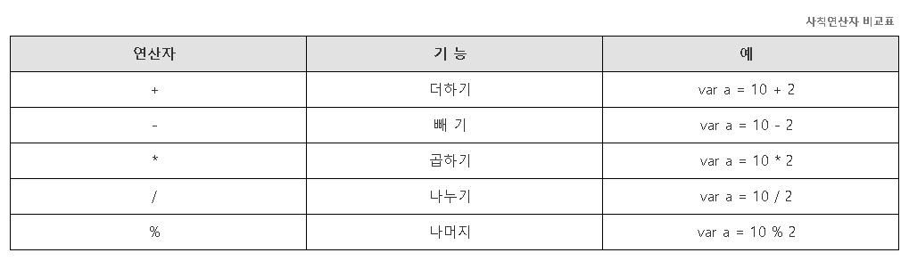

# CH04.  기본 문법 

<br>
<br>  

## 1.변수 선언

<br>

### 1) 변수

자바스크립트 변수는 데이터를 저장하고 조작하기 위해 사용되는 이름이 있는 저장소입니다.

자바스크립트에서는 `var`, `let`, `const` 키워드를 사용하여 변수를 선언할 수 있으며,각각의 키워드는 스코프와 재할당 가능성 등에서 차이가 있습니다.

<br>  

### 2) 상수

자바스크립트에서 상수(constant)는 값이 변경되지 않는 변수를 의미합니다. `const` 키워드를 사용하여 상수를 선언합니다. 한 번 할당된 값은 재할당할 수 없고, 

상수는 반드시 선언과 동시에 초기화되어야 합니다.

<br>  

### 3) 변수의 선언

#### A. 스코프에 따른 변수의 종류

- 전역변수 : 문서 전체에 영향을 주는 변수로, 영역(함수)에 관계없이 어디서든지 사용이 가능한 변수
- 지역변수 : 함수내에서 선언되어 사용되는 변수로 그 함수 내에서만 영향력을 가지는 변수며, 함수를 호출하였을 경우만 변수로 작동하다가 함수가 종료되면 소멸되는 변수

<br>

#### B.  `var`, `let`, `const` 키워드

a)  `var` 키워드

#### 

- 스코프: `var`로 선언된 변수는 함수 스코프를 가집니다. 이는 변수가 선언된 함수 내부에서만 유효하다는 것을 의미합니다. 이를 지역변수라 합니다. 함수 외부에서 `var`를 사용하면 전역 변수가 됩니다.

- 재할당 가능: `var`로 선언된 변수는 값을 재할당할 수 있습니다.
- 같은 이름의 변수 선언 가능


- 변수 선언 및 재할당 가능

```
// var - 기존 ES5 변수선언 방식
 var a = 10;
console.log(a);
    
var a = 20;     // <=  'var'로 선언된 변수는 같은 이름의 변수 사용 가능!
console.log(a);
```

<br>
  
- 함수 스코프: 함수내 선언된 변수는 선언된 함수 내에서만 영향을 받음. 나머지 블록 스코프의 영향을 받지 않음

```
// 함수 스코프
function test() {
    var x = 10;
    console.log(x); // 10
}
console.log(x); // ReferenceError: x is not defined

// { } : 블록스코프
{
  var a = 10;
}    
console.log(a);          //  <= 'var'는 함수의 블록범위에만 영향을 받음!
```

<br>  

b)  `let` 키워드

- 스코프: `let`으로 선언된 변수는 블록 스코프를 가집니다. 이는 변수가 선언된 블록(`{}`) 내부에서만 유효하다는 것을 의미합니다.

- 재할당 가능: `let`으로 선언된 변수는 값을 재할당할 수 있습니다.
- 같은 이름의 변수 선언 불가능

- 변수 선언 및 재할당 가능

```
// let - 기존 ES5 변수선언 방식
let b = 10;
console.log(b);
    
// let b = 20;
b = 20;        // <=  'let'로 선언된 변수는 같은 이름의 변수 사용 불가능!
console.log(b);
```

<br>

- 블록 스코프: ‘let’ 변수는 선언된 모든 블록 `{}` 내에서만 접근 가능.

```
// { } : 블록스코프
{
  let b = 20;
}    
console.log(b);      //  <= 'let & const'는 함수뿐만 아니라 모든 블록 스코프의 영향을 받음!
```

<br>  

c)  `const` 키워드

- 블록 스코프: `const`로 선언된 상수는 블록 스코프를 가지며, 이는 상수가 선언된 블록 `{}` 내에서만 유효함을 의미합니다.

- 재할당 불가능: `const`로 선언된 변수는 한 번 할당된 후 값을 변경할 수 없습니다. 따라서, 상수로 사용되는 변수의 값은 고정됩니다.
- 같은 이름의 변수 선언 불가능

- 상수 선언: 선언과 동시에 초기화 필요, 재할당 불가능.

```
// const(상수) - 기존 ES5 변수선언 방식
const c = 30;
// c = 50;    //  <= 'const'로 선언된 변수는 상수이므로, 값을 재선언 할 수 없음!
console.log(c);
```

  
- 블록 스코프: ‘const’ 변수는 선언된 모든 블록 `{}` 내에서만 접근 가능.

<br>

d)  반복문 에서 유효범위

```
// 반복문에서의 유효범위
var num1 = 10;

for(var num1=0; num1<5; num1++){
  console.log(num1);    // 0, 1, 2, 3, 4, 5  <= 마지막 값음 증가시켜 종료 후 재할당 처리된 것임! 
}
console.log(num1);

var num2 = 10;
for(let num2=0; num2<5; num2++){
  console.log(num2);    // 0, 1, 2, 3, 4, 10
}
console.log(num2);
```

<br>  

### 4) 변수 선언 방법  

1) 변수는 반드시 영문 대소문자가 와야한다.    ex) Aa01, aA01  
2) 변수명 첫글자에는 숫자가 올 수 없다.    ex) 01Aa, 01\_Aa  
3) 변수명 사이에는 스페이스(공백) 공간을 둘 수 없다.    ex) count 01  
4) 변수명은 영문 대소문자를 구분한다.    ex) Aa != aA  
5) 변수명으로 색상이 변하는 단어(예약어)는 사용할 수 없다.    ex) var, if, break 등 ...  
6) 변수명에는 특수기호를 사용할 수 없다. (단, '$'와 '\_'는 사용 가능!)    ex) $Aa, \_Aa  
7) 변수명은 의미를 담을 수 있는 이름으로 지정하고, 일명 낙타봉(카멜표기법) 표기법으로 작성할 것을 권장한다.  
     ex) imagename(X) / imageName(O)

<br>  

### 5) 변수에 들어있는 값 확인방법

### 1) alert()

alert() 함수는 특정 정보를 사용자에게 메세지 창으로 알려주기 위해 주로 사용합니다. 특히, 자바스크립트 기초 문법을 배울 때 문법테스트용으로도 사용합니다.

```
alert(데이터)
```

<br>

### 2) document.write()

자바스크립트의 Document라는 객체에는 제공하는 write() 기능은 HTML 문서에 Body 영역에 HTML태그 내용을 출력합니다. 브라우저 화면에 출력하는 기능때문에 프로그래밍 문법 테스트용으로 사용하기도 합니다.

```
document.write(데이터)
```

<br>

### 3) console.log()

개발을 하다보면 오류가 생겼을 때 오류를 찾아서 수정해야 할 경우들이 많은데 이를위해 개발자들을 위한 디버깅 도구들이 필요한데 console.log()는 대표적인 디버깅 도구입니다. 웹킷 엔진을 사용하는 브라우저인 크롬과 사파리에서만 사용가능하며 출력값은 디버깅 기능을 가지고 있는 콘솔창에서 출력됩니다.

```
console.log(데이터)
```

<br>
<br>

## 2\. 데이터 타입

<br>

### 1) 원시형 데이터

A. 숫자 (Number)

- 정수와 부동 소수점 숫자.

```
let integer = 10;
let float = 3.14;
```

<br>

B. 문자열 (String)

- 문자들의 집합, 큰따옴표 또는 작은따옴표로 묶음.

```
let singleQuote = 'Hello';
let doubleQuote = "World";
```

<br>

C. 불리언 (Boolean)

- 참(`true`) 또는 거짓(`false`).

```
let isTrue = true;
let isFalse = false;
```

<br>

D. null

- 의도적으로 비어 있음을 나타냄.

```
let empty = null;
```

<br>

E. undefined

- 값이 할당되지 않은 변수.

```
let notDefined;
console.log(notDefined); // undefined
```

<br>

### 2) 객체형 데이터  

A. 함수형 (Object)

- 함수가 데이터로 전달되었을 경우

```
// * 함수가 데이터로 전달되었을 경우 실행할 때 함수실행구문 '()' 을 적용할 것!
var test = function(){
  return "함수를 값으로 전달해 봅시다!";
}
document.write( test() + "<br>" );
```

<br>  

B. 배열 (Object)

- 값으로만 구성된 데이터 집합.

```
var array = [ '딸기', '바나나', '사과' ];

// 오늘의 추천과일은 '과일명' 입니다!
document.write( "오늘의 추천과일은 '" + array[0] + "' 입니다! <br>" );
```

<br>  

C. 객체 (Object)

- '속성(key):값(key value)'으로 구성된 데이터 집합.

```
var obj = {
  name : 'Fiat',
  model : 500,
  weight : '850kg',
  event: function(){
    return "오늘 구매하시면 80% 세일해 드립니다!";
  }
};

// 출력문장 : 현재 가진 차량은 'Fiat' 이고, 모델은 '500' 입니다!
document.write( "현재 가진 차량은 '" + obj.name + "' 이고, 모델은 '" + obj.model + "' 입니다! <br>" );

// 출력문장 : 오늘의 이벤트 혜택 : "오늘 구매하시면 80% 세일해 드립니다!"
document.write(" 오늘의 이벤트 혜택 : '" + obj.event() + "' ");
```

<br>

### 3) Typeof 연산자  

`typeof` 연산자는 변수의 자료형을 문자열 형태로 반환합니다. 기본 자료형(primitive type)과 객체 유형(object type)을 확인하는 데 주로 사용됩니다.  

```
console.log(typeof 42); // "number"
console.log(typeof 'Hello'); // "string"
console.log(typeof true); // "boolean"
console.log(typeof undefined); // "undefined"
console.log(typeof { name: "Alice" }); // "object"
console.log(typeof [1, 2, 3]); // "object"
console.log(typeof function() {}); // "function"
console.log(typeof null); // "object" (JavaScript의 버그로 인한 결과)
```

<br>

### 4) 형 변환

자바스크립트에서 형변환(type conversion)은 값을 다른 자료형으로 변경하는 과정을 말합니다. 자바스크립트에서는 암시적(implicit) 형변환과 명시적(explicit) 형변환이 있습니다.

<br>

#### A. 암시적 형변환 

자바스크립트는 종종 자동으로 자료형을 변환하여 표현식을 평가합니다. 이를 암시적 형변환 또는 타입 강제(coercion)라고 합니다.  

```
console.log('5' + 5); // "55" (문자열로 변환 후 연결)
console.log('5' - 2); // 3 (문자열을 숫자로 변환 후 뺄셈)
console.log(true + 1); // 2 (true가 1로 변환)
console.log(false + 1); // 1 (false가 0으로 변환)
console.log(5 * null); // 0 (null이 0으로 변환)
console.log('5' * '2'); // 10 (문자열을 숫자로 변환 후 곱셈)
```

<br>  

#### B. 명시적 형변환 

명시적 형변환은 개발자가 직접 자료형을 변환하는 것입니다. 자바스크립트에서는 여러 방법으로 명시적 형변환을 수행할 수 있습니다.

<br>

a) 숫자로 변환

- Number 함수 사용

```
console.log(Number('123')); // 123
console.log(Number('123abc')); // NaN (숫자로 변환 불가능한 경우)
console.log(Number(true)); // 1
console.log(Number(false)); // 0
```

<br>

- parseInt, parseFloat 함수 사용

```
console.log(parseInt('123')); // 123
console.log(parseInt('123abc')); // 123
console.log(parseFloat('123.45')); // 123.45
console.log(parseFloat('123.45abc')); // 123.45
```

<br>

- 단항 더하기 연산자 사용

```
console.log(+'123'); // 123
console.log(+'123.45'); // 123.45
console.log(+true); // 1
console.log(+false); // 0
```

<br>

b) 문자로 변환  

- String 함수 사용

```
console.log(String(123)); // "123"
console.log(String(true)); // "true"
console.log(String(false)); // "false"
console.log(String(null)); // "null"
console.log(String(undefined)); // "undefined"
```

<br>

- toString 메서드 사용

```
console.log((123).toString()); // "123"
console.log((true).toString()); // "true"
console.log((false).toString()); // "false"
```

<br>
<br>  

## 3\. 연산자

자바스크립트 연산자란 데이터 조합하고 연결하기 위해 사용되는 기호나 부호를 지칭하며 자바스크립트는 여러 종류의 연산을 위한 다양한 연산자(operator)를 제공하고 있습니다.

<br>  

### 1) 문자열 연산

자바스크립트에서는 숫자뿐 아니라 문자도 합칠 수 있습니다. 두개의 문자열을 하나로 합칠 때는 더하기(+) 연산자는 사용합니다.

```
let str1 = "Hello";
let str2 = "World";
let result = str1 + " " + str2;
console.log(result); // "Hello World"
```

<br>

### 2) 산술 연산자

산술 연산자는 사칙연산을 다루는 가장 기본적이면서도 많이 사용하는 연산자입니다. 덧셈, 뺄셈, 곱셈, 나눗셈에서 연산 순서는 왼쪽에서부터 오른쪽으로 차례대로 계산하되, 

곱셈과 나눗셈을 먼저 계산하고, 그 다음 덧셈과 뺄셈을 계산하는 것이다. 곱셈과 나눗셈은 우선순위가 동일하므로 어느 것을 먼저 해도 관계없다. 덧셈과 뺄셈도 마찬가지로 우선순위는 동일하다. 

괄호가 있을 경우는 괄호가 사칙연산보다 우선한다.

  

<br>

### 3) 복합 연산자

복합연산자는 연산자를 짧게 표현하고자 할 때 사용하는 문법입니다.

  

<br>

### 4) 증감 연산자

증감연산자는 하나의 변수에 1을 더하거나 빼는 구문을 간단하게 표현하고자 할 때 사용합니다.

  

<br>
<br>

### 5) 전위 & 후위 연산

증감 연산자를 설명할 때 '++, --' 연산자를 변수 뒤에 두고 사용했는데 사실은 변수 앞에도 연산자가 올 수 있습니다. 이때 변수앞에 증감 연산자가 오면 '전위 연산자'라 부르며, 뒤에 오면 '후위 연산자'라고 부릅니다. 

전위 연산자와 후위 연산자는 거의 같은 것처럼 보이나 결과값은 전혀 다르게 나타납니다.

<br>

#### A.  전위 연산자

전위 연산자를 사용하는 변수는 자기 자신을 먼저 증가시키기 때문에 a와 b의 값은 같습니다.

```
<script>
	// 해석 전
	var a = 1;
	var b = ++a;

	// 해석 후
	var a = 1;
	a = a + 1;  <- a = 2 (자기 자신을 증가시킴)
	var b = a;  <- b = 2 (변수는 값을 먼저 변수에게 넘겨줌)
</script>
```

<br>

#### B.  후위 연산자

후위 연산자를 사용하는 변수는 값을 먼저 변수에게 넘겨준 후 자기 자신을 증가시키기 때문에 a와 b의 값은 다르게 됩니다.

```
<script>
	// 해석 전
	var a = 1;
	var b = a++;

	// 해석 후
	var a = 1;
	var b = a;  <- b = 1 (변수는 값을 먼저 변수에게 넘겨줌)
	a = a + 1;  <- a = 2 (자기 자신을 증가시킴)

	// 적용 예시 (반복문에서 증감식 : i++, i--)
        var i = 0;
	i++;
	var b = i;  <- b = 1 (증가시킨 변수를 값을 다른 변수에 담아 재호출해서 확인시 증감확인)
	console.log(i);
</script>
```

<br>

### 6) 비교 연산자

비교 연산자는 피연산자 사이의 상대적인 크기를 판단하여, 참(true)과 거짓(false)을 반환합니다. 비교 연산자는 모두 두 개의 피연산자를 가지는 이항 연산자이며, 피연산자들의 결합 방향은 왼쪽에서 오른쪽입니다.

  

<br>

### 7) 논리 연산자

논리 연산자는 주어진 논리식을 판단하여, 참(true)과 거짓(false)을 반환합니다. && 연산자과 || 연산은 두 개의 피연산자를 가지는 이항 연산자이며, 피연산자들의 결합 방향은 왼쪽에서 오른쪽입니다.

  

<br>

### 8) 삼항 연산자

삼항 연산자는 유일하게 연산자를 세 개나 가지는 조건 연산자입니다. 물음표(?) 앞의 표현식에 따라 결과값이 참이면 반환값1을 반환하고, 결괏값이 거짓이면 반환값2를 반환합니다.

```
// 문법
표현식 ? 반환값1 : 반환값2

// 사용예시
var x = 3, y = 5;

var result = (x > y) ? x : y   // x가 더 크면 x를, 그렇지 않으면 y를 반환함.

console.log("둘 중에 더 큰 수는 " + result + "입니다.");
```