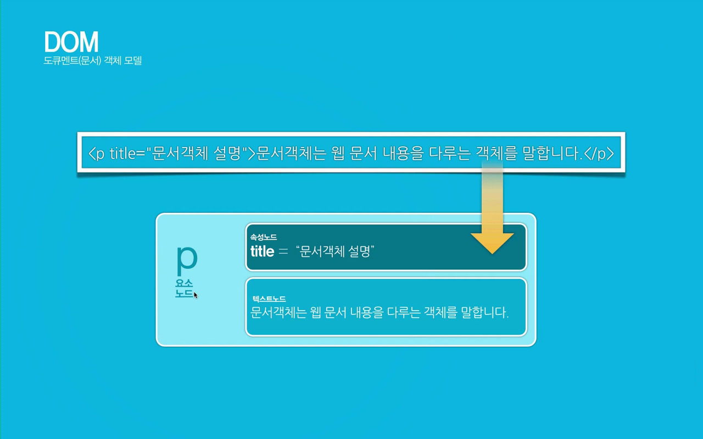

# CH15. 자바스크립트 문서객체모델(DOM)

<br>
<br>

## 1. 자바스크립트 문서객체모델 (DOM - Document Object Model)

<br>

DOM은 W3C (World Wide Web Consortium) 표준으로 문서에 접근하기 위한 표준을 정의합니다. W3C DOM 표준은 아래 세 가지 부분으로 구분됩니다. 

그중에서 'HTML DOM'은 HTML에 대한 표준 '객체 모델 및 프로그래밍 인터페이스'입니다. 즉, HTML DOM을 사용하면 JavaScript가 HTML 문서의 모든 요소에 액세스하여 이를 변경할 수 있습니다. 

그것은 'HTML DOM' 을 이용해서 HTML 요소에 접근한 다음 요소를 가져 오거나, 변경하거나, 추가하거나, 삭제 할 수 있다는 뜻입니다.

<br>

1) Core DOM - 모든 문서 유형에 대한 표준 모델  
2) XML DOM - XML ​​문서의 표준 모델  
3) HTML DOM - HTML 문서의 표준 모델  

<br>

### 1) DOM은 W3C의 표준 객체 모델이며, 다음과 같이 계층 구조로 표현됩니다.

  


  
<br>
  

### 2) 자바스크립트는 객체 모델을 이용하여 할 수 있는 작업들

  

1) JavaScript는 페이지의 모든 HTML 요소를 변경할 수 있습니다.  
2) JavaScript는 페이지의 모든 HTML 속성을 변경할 수 있습니다.  
3) JavaScript는 페이지의 모든 CSS 스타일을 변경할 수 있습니다.  
4) JavaScript는 기존 HTML 요소 및 속성을 제거 할 수 있습니다.  
5) JavaScript는 새로운 HTML 요소와 속성을 추가 할 수 있습니다.  
6) JavaScript는 페이지의 모든 기존 HTML 이벤트에 반응 할 수 있습니다.  
7) JavaScript는 페이지에서 새로운 HTML 이벤트를 생성 할 수 있습니다.  
  
<br>
<br>

## 2. HTML DOM 문서 객체

'document' 객체는 웹 페이지를 나타냅니다. HTML 페이지의 요소에 액세스하려면 항상 문서 객체에 접근해야 합니다.   
다음은 HTML에 액세스하고 조작하기 위해 문서 객체를 사용하는 방법에 대한 몇 가지 예입니다.

<br>

### 1) HTML 요소 찾기

HTML 요소 찾기 비교표

| 메서드 | 적용 내용 |
| --- | --- |
| document.getElementById('id') | HTML 요소 아이디(id)를 이용한 선택 |
| document.getElementsByTagName('name') | HTML 요소 태그이름(Tagname)을 이용한 선택 |
| document.getElementsByClassName('name') | HTML 요소 클래스이름(Classname)을 이용한 선택 |
  
<br>  

### 2) HTML 요소 변경하기

HTML 요소 변경 비교표

| 메서드 | 적용 내용 |
| --- | --- |
| element.innerHTML = "내용변경 텍스트" | HTML 요소의 내용 변경 |
| element.getAttribute( 'attributename' ) | HTML 요소 속성 값 가져오기 |
| element.setAttribute('attributename', 'value') | HTML 요소 속성 값 변경하기 |
| element.removeAttribute('attributename') | HTML 요소 속성 제거하기 |
| element.style.property = 'new style value' | HTML 요소 스타일 변경하기 |

<br>  

### 3) HTML 요소 추가 및 삭제

HTML 요소 추가 삭제 비교표

| 메서드 | 적용 내용 |
| --- | --- |
| document.createElement('element') | HTML 요소의 생성 |
| document.createTextNode('text') | HTML 요소의 생성 |
| document.removeChild('element') | HTML 요소의 제거 |
| document.appendChild('element') | 선택한 요소 안에 마지막 자식 요소로 추가 |
| document.replaceChild('new element', 'old element') | HTML 요소 스타일 변경하기 |

<br>

### 4) HTML 이벤트 핸들러 추가

HTML 요소 이벤트 핸들러 추가표

| 메서드 | 적용 내용 |
| --- | --- |
| document.getElementById(아이디).onclick = function(){ 실행할 코드 } | 마우스 클릭 이벤트와 연결될 이벤트 핸들러 코드를 추가 |

<br>
<br>

## 3. 자바스크립트 노드(Node)

<br>

### 1) 노드란?

DOM은 노드(node)의 집합이라 할 수 있으며, DOM의 노드에는 요소노드, 속성노드, 텍스트노드로 구성되어 있다. 

노드는 DOM의 구조를 이루는 최소 단위이며, 이 노드들의 집합체가 DOM이라 할 수 있다.

<br>


<br>

### 2) 노드의 특징

노드 트리의 노드는 서로 계층 관계를 갖습니다. 상위, 하위 및 형제라는 용어는 관계를 설명하는 데 사용됩니다.

  


  

1) 노드 트리에서 최상위 노드는 루트 (또는 루트 노드) 입니다.  
2) 모든 노드에는 정확히 하나의 부모가 있지만 루트노드 (부모가 없음)  
3) 노드는 많은 수의 자식을 가질 수 있습니다.  
4) 형제 (형제 또는 자매)는 같은 부모를 가진 노드입니다.

<br>

### 3) 노드의 구성

W3C HTML DOM 표준에 따르면 HTML 문서의 모든 것이 노드입니다. 노드를 이루는 구성은 아래와 같습니다.  



<br>

1) 전체 문서가 문서 노드입니다.  
2) 모든 HTML 요소는 요소 노드입니다.  
3) HTML 요소 내부의 텍스트는 텍스트 노드입니다.  
4) 모든 HTML 속성은 속성 노드입니다 (사용되지 않음).  
5) 모든 주석은 주석 노드입니다.

<br>

```
// 요소 생성하기
var parentTitle = document.getElementsByClassName('panel-body');
var h3 = document.createElement('h3');
var p = document.createElement('p');
var img = document.createElement('img');
var text1 = document.createTextNode('Dom Tree 구조 생성');
var text2 = document.createTextNode('3) Dom Tree 구조 탐색');

// 노드 연결하기
parentTitle[0].appendChild(h3);
h3.appendChild(text1);

parentTitle[0].appendChild(p);
p.appendChild(img);

img.width = 800;
img.height = 300;
img.src = "http://wdschool.woobi.co.kr/javascript/images/node.jpg";
img.alt = "노드 탐색 이미지";

// 요소 변경하기
var lastTitle = document.getElementsByTagName('h3');
lastTitle[9].replaceChild(text2, text1);
```

<br>  

### 4) Dom Tree 구조 탐색  

  

  
<br>
<br>
  

## 4. 실습 예제

  

#### HTML 코드

```
<h1>[ 자바스크립트 문서객체모델 (DOM - Document Object Model) ]</h1>

<p>DOM은 W3C (World Wide Web Consortium) 표준으로 문서에 접근하기 위한 표준을 정의합니다. W3C DOM 표준은 아래 세 가지 부분으로 구분됩니다. 그중에서 'HTML DOM'은 HTML에 대한 표준 '객체 모델 및 프로그래밍 인터페이스'입니다. 즉, HTML DOM을 사용하면 JavaScript가 HTML 문서의 모든 요소에 액세스하여 이를 변경할 수 있습니다. 그것은 'HTML DOM' 을 이용해서 HTML 요소에 접근한 다음 요소를 가져 오거나, 변경하거나, 추가하거나, 삭제 할 수 있다는 뜻입니다.</p>

<div></div>
```

<br>

#### Javascript 코드

```
<script>
    var body = document.body;
    console.log(body);

    // 노드 구성 :  요소노드(1), 속성노드(2), 텍스트노드(3)
    // 노드로 하위요소 체크하기
    var childElement = body.childNodes[5];
    console.log(childElement);

    // 노드 생성 - 텍스트 노드 추가하기
    var text1 = document.createTextNode('첫번째 박스');

    // 노드에 연결하기
    childElement.appendChild(text1);

    childElement.style.color = "green";
    childElement.style.fontSize = "30px";
    childElement.style.width = "500px";
    childElement.style.height = "50px";
    childElement.style.margin = "50px 0";
    childElement.style.border = "1px solid #000";


    // 노드 생성 - 요소 노드 추가하기
    var title1 = document.createElement('h2');
    var text2 = document.createTextNode('두번째 타이틀입니다!');
    var para = document.createElement('p');
    var img = document.createElement('img');

    // 이미지 설정
    img.src = "images/dom4.jpg";
    img.width = 800;
    img.height = 600;

    // 노드 연결하기
    body.appendChild(title1);
    title1.appendChild(text2);

    body.appendChild(para);
    para.appendChild(img);


    // 특정 요소 이전에 내용 추가하기
    // - 대상.insertBefore(newChild, refChild);
    var title2 = document.createElement('h2');
    var text3 = document.createTextNode('첫번째 타이틀입니다!');

    // 노드 연결하기
    body.appendChild(title2);
    title2.appendChild(text3);

    body.insertBefore(title2, title1);


    // 노드 종류(Type) 체크하기 : 요소노드(1), 속성노드(2), 텍스트노드(3)
    // 요소 노드 체크하기
    console.log( body.childNodes );  
    console.log( body.childNodes[9].nodeName );
    console.log( body.childNodes[9].nodeType );

    // 속성 추가하기
    body.childNodes[9].setAttribute('class', 'title');

    // 속성 노드 체크하기
    console.log( body.childNodes[9].attributes[0].nodeName );
    console.log( body.childNodes[9].attributes[0].nodeType );
    console.log( body.childNodes[9].attributes[0].nodeValue );
    
    // 텍스트 노드 체크하기
    console.log( body.childNodes[9].childNodes[0].nodeName );
    console.log( body.childNodes[9].childNodes[0].nodeType );
    console.log( body.childNodes[9].childNodes[0].nodeValue );


    // 요소에 내용 치환하기
    var title3 = document.createElement('h2');
    var text4 = document.createTextNode('마지막 타이틀입니다!');

    title3.appendChild(text4);

    // 대상.replaceChild(new, old);
    body.replaceChild(title3, title1);

    // 요소 제거하기 - 대상.removeChild(old);
    body.removeChild(title3);

  </script>
```